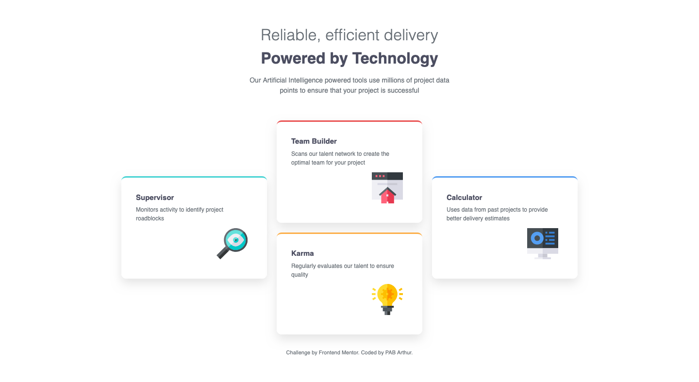

# Frontend Mentor - Four card feature section solution

This is a solution to the [Four card feature section challenge on Frontend Mentor](https://www.frontendmentor.io/challenges/four-card-feature-section-weK1eFYK). Frontend Mentor challenges help you improve your coding skills by building realistic projects.

## Table of contents

- [Overview](#overview)
  - [The challenge](#the-challenge)
  - [Screenshot](#screenshot)
  - [Links](#links)
- [My process](#my-process)
  - [Built with](#built-with)
  - [What I learned](#what-i-learned)
  - [Continued development](#continued-development)
  - [Useful resources](#useful-resources)
- [Author](#author)
- [Acknowledgments](#acknowledgments)

## Overview

### The challenge

Users should be able to:

- View the optimal layout for the site depending on their device's screen size

### Screenshot

### Links

- Solution URL: [GitHub Repository](https://github.com/pabjunior/four-card-feature-section)
- Live Site URL: [Live Demo](https://gilded-palmier-86f312.netlify.app/)

## My process

### Built with

- Semantic HTML5 markup
- CSS custom properties
- Flexbox
- CSS Grid
- Desktop-first workflow

### What I learned

One of the key challenges I faced was controlling the content order between desktop and mobile layouts without modifying the HTML structure. I learned how to use CSS Grid's `order` property to rearrange elements visually based on screen size, keeping the HTML semantic and unchanged.

This was tricky at first, but working through it helped me understand how powerful CSS layout properties are for responsive design.

### Continued development

Moving forward, I want to focus on:

- **CSS Grid mastery** – Deepening my understanding of advanced Grid techniques and when to use Grid vs Flexbox
- **Cleaner CSS** – Writing more maintainable and organized stylesheets with better naming conventions
- **Accessibility** – Learning and implementing accessibility best practices from the start
- **Layout efficiency** – Mastering modern layout techniques to build responsive designs more confidently
- **Design-to-code speed** – Improving my workflow to translate designs into clean code faster

These areas will help me become more efficient and build better, more inclusive web experiences.

### Useful resources

- [CSS Grid Generator](https://cssgridgenerator.io/) - This tool helped me visualize and generate the Grid layout structure. It made understanding Grid properties much easier and sped up my development process.

## Author

- Frontend Mentor - [@pabjunior](https://www.frontendmentor.io/profile/pabjunior)
- GitHub - [@pabjunior](https://github.com/pabjunior)
- Twitter - [@PAB_junior](https://x.com/PAB_junior)

## Acknowledgments

Thanks to Frontend Mentor for providing this challenge and the design files. The platform has been invaluable for practicing real-world design implementation and improving my frontend skills.
